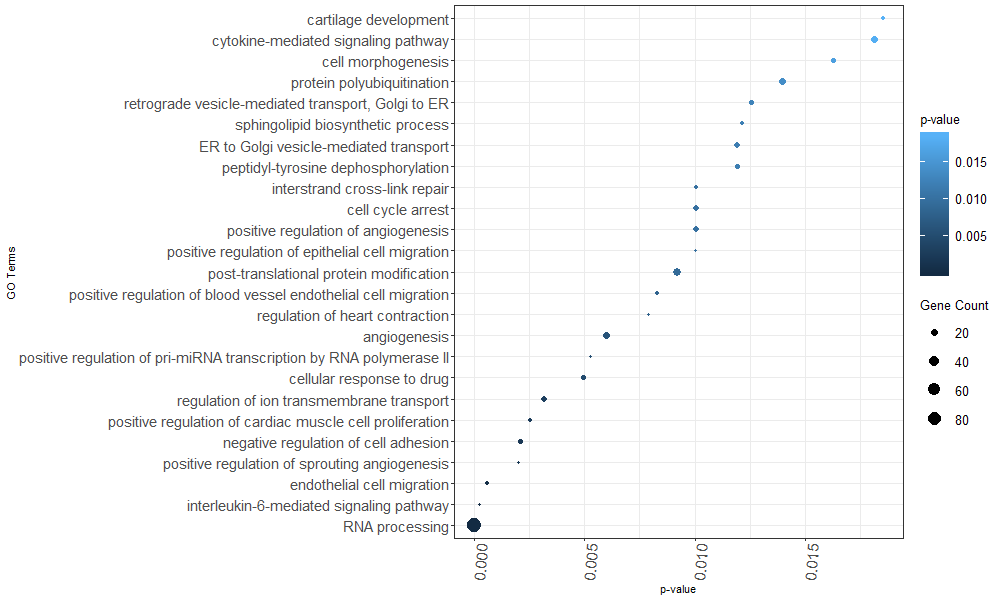

```{r style, echo=FALSE, results="asis", message=FALSE, warnings = FALSE}
knitr::opts_chunk$set(tidy = FALSE,
                      warning = FALSE,
                      message = FALSE,fig.width=6, fig.height=6 )
```


# NORCE

## General Information
NoRCE provides a comprehensive, systematical, user-friendly pipeline for preprocessing, annotation, and enrichment of all types of ncRNA genes such as lncRNA, mature and precursor miRNA, snoRNA, siRNA, circular RNA. NoRCE analyses are based on spatially proximal mRNAs at a certain distance for a set of non-coding RNA genes or regions of interest. Moreover, specific analyses such as biotype filtering, miRNA-mRNA co-expression analysis, miRNA target predictions can be performed for filtering. Besides, it allows curating the gene set according to the topologically associating domain (TAD) boundaries. NoRCE accepts gene lists and gene regions as an input. 


### Supported Assemblies and Organisms
NoRCE supports many organisms and assemblies. To work with supported organisms, the user has to provide the organism assembly, `org_assembly`, with a keyword that is listed in the table. 
 

| Organisms     | Assemblies    | Keyword |
| -------------|:-------------:|:-------------:|
| Homo Sapiens  |  hg19| hg19 |
| Homo Sapiens  |  hg38 | hg38 |
| Mus Musculus   | mm10      |  mm10|
| Rattus Norvegicus |rn6     | rn6     | 
| Danio Rerio  |danRer10     |  dre10|
| Caenorhabditis Elegans |ce11    | ce11    | 
| Saccharomyces Cerevisiae |sc3  | sc3|
| Drosophila Melanogaster  | dm6 | dm6 |


## Installation

To install and load NoRCE:


```{r Install, eval=FALSE, echo=TRUE, include=TRUE}
if (!requireNamespace("BiocManager", quietly = TRUE))
    install.packages("BiocManager")

BiocManager::install("NoRCE")
```
To load the NoRCE:

```{r load, eval=FALSE, echo=TRUE, include=TRUE}
library(NoRCE)
```

Moreover, NoRCE can be downloaded from the [GitHub repository](https://github.com/guldenolgun/NoRCE). 

## Changing Parameter Setting
NoRCE gives freedom to the user. However, to prevent getting lost in parameters, most of them are set to their default value. To change those parameters, which are listed in the [Default Parameters](#default-parameters) section, `setParameters` function should be called, and parameters and their user-defined values should be defined. The table in the [Default Parameters](#default-parameters) section illustrates the possible parameters and their values.


```{r change parameters, eval=FALSE, echo=TRUE, include=TRUE}
type <- c('downstream','upstream')

value <- c(2000,30000)
setParameters(type,value)

#To change the single parameter
setParameters("pathwayType","reactome")
```


## GO Enrichment
GO enrichment analysis can be performed based on gene neighborhood, predicted targets, co-expression values, and/or considering topological domain boundaries. _HUGO_, _ENSEMBL gene_, _ENSEMBL transcript gene_, _ENTREZ ID_, and _miRBase_ names are supported formats for the input gene list. Moreover, NoRCE accepts a list of genomic regions. The input genomic region list should be in a BED format. 

Each analysis is controlled by corresponding parameters. When related parameters are set, the gene sets resulting from the intersection of those analyses will be considered for enrichment analysis. However, co-expression analysis can be augmented with other analyses.

GO enrichment pipeline analysis is carried out with `geneGOEnricher` and `geneRegionGOEnricher` functions for an input gene set and regions, respectively. Also, the miRNA gene enrichment pipeline is carried out with `mirnaGOEnricher` and `mirnaRegionGOEnricher` functions. However, the user can use other functions for performing subparts of the analysis. Species assembly must be defined using the `org_assembly` parameter, which is provided in the Keyword column in the table above. NoRCE allows the user to use a background gene set. 

### Enrichment Analysis Based on Gene Neighbourhood

When the `near` parameter is set to `TRUE`, the closest genes for the input gene list are retrieved. The gene neighborhood taken into consideration is controlled by the `upstream` and `downstream` parameters. By default, those parameters are set to 10 kb and all genes that fall into 10 kb upstream and downstream of the input genes are retrieved. Also, using `searchRegion` parameter, the analysis can be performed for only those genes whose exon or intron regions fall into the specified upstream and downstream range of the input genes.

To perform enrichment analysis based on considering only gene neighborhood:


```{r, gene, eval=FALSE}
#Set the neighbourhood region as exon
ncGO<-geneGOEnricher(gene = brain_disorder_ncRNA, org_assembly='hg19', near=TRUE, genetype = 'Ensembl_gene')

```

To perform enrichment analysis based on exon neighbourhood:

```{r, lysis, eval=FALSE}
#Set the neighbourhood region as exon
setParameters("searchRegion", "exon")

#NoRCE automatically consider only the exon of the genes
ncGO<-geneGOEnricher(gene = brain_disorder_ncRNA, org_assembly='hg19', near=TRUE, genetype = 'Ensembl_gene')

```

NoRCE accepts the BED formatted input gene regions. To perform the enrichment analysis on gene regions:

```{r, region_go, eval=FALSE}
#Change back to all search regions 
setParameters("searchRegion", "all")

#Import the gene set regions
regions<-system.file("extdata", "ncRegion.txt", package = "NoRCE")
regionNC <- rtracklayer::import(regions, format = "BED")

#Perform the analysis on the gene regions
regionGO<-geneRegionGOEnricher(region = regionNC, org_assembly= 'hg19', near = TRUE)

```


### Enrichment Analysis Based on Target Prediction
For a set of miRNA genes, the user can filter the gene set using miRNA target predictions. This analysis is controlled by the `target` parameter. Once the `target` parameter is set to `TRUE`, TargetScan predictions are used to curate the gene list that will be enriched. 

To performed GO enrichment based on neighboring coding genes of brain miRNA targeted by the same brain miRNA gene set.  

```{r, Intersection of the nearest genes of the input gene set and the potential target set is carries out for enrichment analysis, eval=FALSE}
mirGO<-mirnaGOEnricher(gene = brain_mirna, org_assembly='hg19', near=TRUE, target=TRUE)

```

### Enrichment Analysis Based on Topological Associating Domain Analysis
Gene annotation based on topologically associating domain regions is conducted whether ncRNAs fall into the TAD boundaries and coding gene assignment only those that are in the same TAD boundaries are included in the neighborhood coding gene set. If cell-line(s) for TAD boundaries are specified, only regions that are associated with the given cell-line(s) are considered. User-defined and pre-defined TAD boundaries can be used to find potential gene setlist for enrichment. For human, mouse, and fruit fly, pre-defined TAD boundaries are supplied and custom TAD boundaries must be in a BED format. Cell-lines are controlled by the `cellline` parameter. Cell-lines can be listed with the `listTAD` function. 

To perform enrichment based on TAD boundaries that also fall into the noncoding gene's neighborhood

```{r, Enrichment based on TAD cellline, eval=FALSE}
mirGO<-mirnaGOEnricher(gene = brain_mirna, org_assembly='hg19', near=TRUE, isTADSearch = TRUE, TAD = tad_hg19)

```

User-defined TAD regions can be used as an input for the TAD regions and gene enrichment can be performed based on these custom TAD regions. `TAD` parameter is provided to input the bed formatted TAD regions.

```{r, eval=FALSE}
# Read the custom TAD boundaries
cus_TAD<-system.file("extdata", "DER-18_TAD_adultbrain.txt", package = "NoRCE")
tad_custom <- rtracklayer::import(cus_TAD, format = 'bed')

# Use custom TAD boundaries for enrichment
ncGO_tad <- geneGOEnricher(gene = brain_disorder_ncRNA, org_assembly = 'hg19', genetype = 'Ensembl_gene', isTADSearch = TRUE, TAD = tad_custom)

```


To retrieve the list of cell-lines from the given TAD boundaries: 

```{r, Retrieve list of cell-line , eval=FALSE}
a<-listTAD(TADName = tad_hg19)
```


### Enrichment Analysis Based on Correlation Analysis
Enrichment based on correlation analysis is conducted with the binary `express` parameter. For a given cancer, a pre-calculated Pearson correlation coefficient between miRNA-mRNA and miRNA-lncRNA expressions can be used to augment or filter the results. Users can define the correlation coefficient cutoff and cancer of interest with `minAbsCor` and `cancer` parameter, respectively. [miRCancer.db](https://figshare.com/articles/miRCancer\_db\_gz/5576329), the pre-computed miRNA-mRNA and miRNA-lncRNA correlation database, must be downloaded to the local and the path of the database must be given as an input to a `databaseFile` parameter. 


```{r, corr tcga, eval=FALSE}
ncGO_tad <- geneGOEnricher(gene = brain_disorder_ncRNA, org_assembly = 'hg19', genetype = 'Ensembl_gene',near = TRUE, express = TRUE, databaseFile = '\\miRCancer\\miRCancer.db', cancer = 'GBMLGG')

```

Two custom-defined expression data can be utilized to augment or filter the coding genes that are found using the previous analysis. To make this option on, `isCustomExp` parameter has to set `TRUE`, and custom expressions should be inputted to the `exp1` and `exp2` parameters. Expression data must be patient by gene data and headers should be gene names. If no header is defined, `label1` and `label2` must be used to define the headers. The correlation cutoff can be defined with the `minAbsCor` parameter. 

To perform GO enrichment for the intersection of the miRNA targets and custom RNAseq expression of miRNA and mRNA data in NoRCE repository:

```{r, corr analiz, eval=FALSE}

# miRNA targets and custom RNAseq expression of miRNA and mRNA are used 
miGO1 <- mirnaGOEnricher(gene = brain_mirna, org_assembly = 'hg19', target = TRUE, express = TRUE, isCustomExp = TRUE, exp1 = mirna, exp2 = mrna)

```

To augment the results, `isUnionCorGene` parameter has to set to `TRUE`.

```{r, corr union analiz, eval=FALSE}

# Union of miRNA targets and custom RNAseq expression of miRNA and mRNA is utilized for enrichment analysis
miGO1 <- mirnaGOEnricher(gene = brain_mirna, org_assembly = 'hg19', target = TRUE, express = TRUE, isCustomExp = TRUE, exp1 = mirna, exp2 = mrna, isUnionCorGene = TRUE)
```

## Pathway Enrichment
### Enrichment on KEGG, Reactome, WikiPathways
As in GO enrichment analysis, pathway enrichment analysis can be performed based on gene neighborhood, predicted targets, correlation coefficient, and/or topological domain analysis. Each parameter is controlled by the related parameters and _HUGO_, _ENSEMBL gene_, _ENSEMBL transcript_, _ENTREZ ID_, and _miRBase_ name is supported for the input gene list. Non-coding genes can be annotated and enriched with KEGG, Reactome, and Wiki pathways. `genePathwayEnricher` and `geneRegionPathwayEnricher` functions fulfill the pathway enrichment for the genes and regions expect the miRNA genes and for the miRNA `mirnaPathwayEnricher` and `mirnaRegionPathwayEnricher` is used. By default, KEGG enrichment is performed.

```{r, pathway biotype , eval=FALSE}
# KEGG enrichment is performed 
miPathway <- mirnaPathwayEnricher(gene = brain_mirna, org_assembly = 'hg19', near = TRUE, target = TRUE)
```

To perform Reactome and Wiki enrichment

```{r, reactome pathway, eval=FALSE}
# Change the pathway database 
setParameters("pathwayType","reactome")

nc2 <- genePathwayEnricher(gene = brain_disorder_ncRNA, org_assembly =  'hg19', near = TRUE, genetype = 'Ensembl_gene')

# Wiki pathway Enrichment

# Change the pathway database type and multiple testing correction method
type <- c('pathwayType', 'pAdjust')
value<-c('wiki', 'bonferroni')
setParameters(type,value)
nc2 <- genePathwayEnricher(gene = brain_disorder_ncRNA, org_assembly =  'hg19', near = TRUE, genetype = 'Ensembl_gene')
```

### Enrichment on Custom GMT File
Moreover, pathway enriched can be performed based on a custom GMT file. GMT file supports both gene format of ENTREZ ID, Symbol and it is controlled by the `isSymbol` parameter. 

```{r, custom pathway , eval=FALSE}
setParameters("pathwayType","other")

# Name of the gmt file in the local
wp.gmt <- "custom.gmt"

# GMT file should be on the working directory
ncGO_bader <- genePathwayEnricher(gene = brain_disorder_ncRNA, org_assembly = 'hg19',genetype = 'Ensembl_gene',gmtName = wp.gmt)
```

## Biotype Specific Analysis
Users can work with only biotypes of interest or can extract some biotypes from the gene list of interest. To get the biotype specific gene list, which is annotated with given biotype(s), `filterBiotype` function should be called. The path of the GTF file or the path of the zipped GTF file must be provided. 

```{r, extract biotype , eval=FALSE}
biotypes <- c('unprocessed_pseudogene','transcribed_unprocessed_pseudogene')

#Temp.gft is a subset of GENCODE Long non-coding RNA gene annotation
fileImport<-system.file("extdata", "temp.gtf", package = "NoRCE")

extrResult <- filterBiotype(fileImport, biotypes)
```

Moreover, users can collect the input gene list's gene biotype relationships using `extractBiotype` function from the given GTF formatted file.


```{r, biotype process , eval=FALSE}
#Extract biotype gene interactions from the given GTF formatted file
fileImport<-system.file("extdata", "temp.gtf", package = "NoRCE")

#Creates 2 dimensional input Gene-Biotype matrix
gtf <- extractBiotype(gtfFile = fileImport)
```

## Visualization
NoRCE allows us to visualize the enrichment results for pathway and GO enrichments in several forms. 

### Tabular Format

Users can write the results in a tabular format in a TXT file. To save the result in a tabular format, `writeEnrichment` function should be called. Users can write sorted all or their defined number of enrichment results using the `n` parameter. If the `n` parameter is not defined, all results will be written. Results are sorted based on p-value or p-adjusted value. Users should use the `type` parameter to identify their sort preferences. By default, results are sorted based on the p-adjusted value. By default, it is tab-separated but the users can use their preferred separator.

The tabular format contains those fields: GO/pathway ID, pathway/GO term, p-value, p-adjust, gene ratio, background gene ratio, number of enriched genes, annotated gene list with the enriched terms, input noncoding gene list that is annotated with enriched protein-coding genes.  


```{r, tabular, eval=FALSE}
writeEnrichment(mrnaObject = ncGO,fileName = "result.txt",sept = "\t",type = "pvalue")

writeEnrichment(mrnaObject = ncGO,fileName = "result.txt",sept = "\t",type = "pvalue", n = 5)
```

### Dot Plot 
Results can be visualized in the dot plot. Top enrichment results according to p-value or p-adjust value are provided, also, the number of annotated genes with the enriched term is supplied. Users have an option to select p-value or p-adjust value for visualization with the `type` parameter also the `n` parameter should be used for top enrichment results. Dot plots can be used for pathway and GO enrichment.


```{r, dot, eval=FALSE}
drawDotPlot(mrnaObject = ncGO, type = "pvalue", n = 25)
```



### Network
NoRCE generates gene - enriched terms network to present the relationship between terms and enriched results. Same with dot plots, `type` parameter and `n` parameter can be utilized. By default, nodes are the enriched terms and annotated genes, edges represent the relationship. However, the users can choose to generate a network where nodes input noncoding gene lists that are annotated with enriched protein-coding genes instead of protein-coding genes. This is control by the boolean `isNonCode` parameter. If it is set to `TRUE`, input noncoding genes are utilized. Also, by default, GO-term/pathway-term are used for network generation, but, GO IDs or pathway IDs can be used. This is control by the boolean ` takeID` parameter. If it is set to `TRUE`, the naming decision of the GO/pathway node is GO ID-pathway ID. This network can be used for the pathway and GO enrichment findings. 

```{r, network, eval=FALSE}
createNetwork(mrnaObject = ncGO, type = 'pvalue', n = 2, isNonCode = TRUE)
```


### GO DAG
NoRCE draws the GO directed acyclic graph for a given number of enrichments. Enriched GO terms are colored in terms of their p-value or p-adjust value. Users can download PNG or SVG formatted DAGs.

```{r, dag, eval=FALSE}
getGoDag(mrnaObject = ncGO,type = 'pvalue', n = 2,filename = 'dag.png', imageFormat = "png")
```


### Reactome and KEGG Map
Reactome and KEGG pathway maps can be generated in a browser. Users should select the enriched pathway, `pathway`. Even though the Reactome map is visualized in the browser, the user can select PNG or SVG as an image format with `imageFormat` parameter.


```{r, kegg diagram, eval=FALSE}
getKeggDiagram(mrnaObject = ncRNAPathway, org_assembly ='hg19', pathway = ncRNAPathway@ID[1])
```

```{r, reactome diagram, eval=FALSE}
getReactomeDiagram(mrnaObject = ncRNAPathway, pathway = miGO1@ID[3], imageFormat = "png")
```


## Extra Analysis 
### Getting miRNA Targets
You can get the miRNA targets for a given input. The output is miRNA-mRNA target pairs.

```{r, targetmi, eval=FALSE}
target <- predictmiTargets(gene = brain_mirna[1:100,],                   
                     org_assembly = 'hg19', type = "mirna")
```

### Custom Co-expression Analysis
NoRCE can also perform co-expression analysis between two datasets. `exp1` and `exp2` parameters take expression data and each column must contain gene expression. If the expression data does not contain the header information, `label1` and `label2` parameter must be used for this information. `calculateCorr` function calculates the variance of each gene's expression, and genes that vary lesser than the user-defined variance cutoff, `varCutoff`, are excluded from the analysis. The users can select their preferred correlation method, `corrMethod`, with an alternative hypothesis, `alternate` for a given p-value, confidence and minimum correlation cut off, `pcut`, `conf`,`corCutoff`, respectively.  

```{r, coexp, eval=FALSE}
corAnalysis<-calculateCorr(exp1 = mirna, exp2 = mrna )
```

### Identifying GO Annotations For the Given Genes
NoRCE can identify the GO annotatıon for a given gene set. To only annotate the genes with GO terms, `annGO` function should be called. The input gene list should be in the HUGO gene format.

```{r, go annot, eval=FALSE}
geneList <- c("FOXP2","SOX4","HOXC6")

annot <- annGO(genes = geneList, GOtype = 'BP',org_assembly = 'hg19')[[2]]

```

### Get Closeby Genes 
User can detect closeby genes in a given upstream and downstream ranges. `annGO` 

```{r,closeby genes,  eval=FALSE}
neighbour <- getUCSC(bedfile = regionNC,
                    upstream = 1000,
                    downstream = 1000,
                    org_assembly = 'hg19')

```

## Default Parameters

| Parameter     | Possible or Example Values   |
| -------------|:-------------:|
|upstream |Numeric Interval in bp, Ex: 100|
|downstream|Numeric Interval in bp. Ex: 100|
|searchRegion  |'all','exon','intron'|
|GOtype |'BP', 'CC', 'MF'|
|pCut|Threshold value for the pvalue. Range between [0,1]. Ex: 0.05|
|pAdjCut|Threshold value for the adjusted pvalue. Range between [0,1]. Ex: 0.05|
|pAdjust | 'holm','hochberg','hommel','bonferroni', 'BH', 'BY','fdr', 'none'|
|enrichTest |'hyper', 'binom', 'fisher', 'chi'|
|varCutoff|Variance cutoff. Ex: 0.05|
|minAbsCor|Cutoff value for correlation. It has to range between [-1,1]|
|pcut|P-value cut off for the correlation. EX: 0.05 |
|conf |Confidence value for correlation. Ex: 0.95|
|min|Minimum number of genes for enrichment. Ex: 5|
|cellline|List of cell-lines in TAD boundaries.|
|corrMethod |'pearson', 'kendall', 'spearman'|
|alternate |'greater', 'two.sided', 'less'|
|pathwayType| 'kegg', 'reactome','wiki','other'|
|isSymbol| TRUE, FALSE|
|express| TRUE, FALSE. By default it is FALSE|
|target| TRUE, FALSE. By default it is FALSE|
|near| TRUE, FALSE. By default it is FALSE|
|isTADSearch| TRUE, FALSE. By default it is FALSE|
|cancer|ACC, BLCA, BRCA, CESC, CHOL, COAD, COADREAD, DLBC, ESCA, GBMLGG, HNSC, KICH, KIPAN, KIRC, KIRP, LGG, LIHC, LUAD, LUSC, OV, PAAD, PCPG, PRAD, READ, SARC,SKCM, STAD, STES, TGCT, THCA, THYM, UCEC, UCS, UVM |

Citation : Olgun G, Nabi A, Tastan O (2019). “NoRCE: Non-coding RNA sets cis enrichment tool.” bioRxiv, 663765. 

@Credits: Gulden Olgun