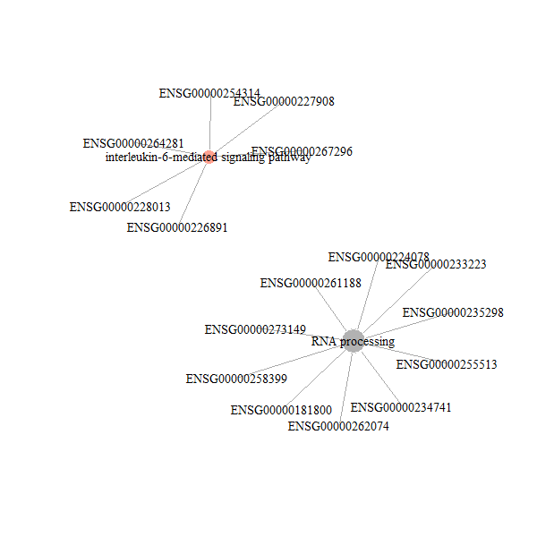

```{r style, echo=FALSE, results="asis", message=FALSE, warnings = FALSE}
knitr::opts_chunk$set(tidy = FALSE,
                      warning = FALSE,
                      message = FALSE,fig.width=6, fig.height=6)
```


# Noncoding RNA Set Cis Annotation and Enrichment

[NoRCE](https://github.com/guldenolgun) package systematically performs annotation and enrichment analysis for a set of regulatory non-coding RNA genes. NoRCE analyses are based on spatially proximal mRNAs at a certain distance for a set of non-coding RNA genes or regions of interest. Moreover, specific analyses such as biotype selection, miRNA-mRNA co-expression, miRNA-mRNA target prediction can be performed for filtering. Besides, it allows to curate the gene set according to the topologically associating domain (TAD) regions. Work flow of the package can be seen below:
<center> {width=800px} </center>

## Supported Assemblies and Organisms
+ *Homo Sapiens (hg19 and hg38)*
+ *Mus Musculus (mm10)*
+ *Rattus Norvegicus (rn6)*
+ *Drosophila Melanogaster (dm6)*
+ *Danio Rerio (danRer10)*
+ *Caenorhabditis Elegans (ce11)*
+ *Saccharomyces Cerevisiae (sc3)*


# GO Enrichment Analysis 

GO enrichment analysis can be performed based on gene neigbourhood, predicted targets, co-expression values and/or topological domain analysis. HUGO, ENSEMBL gene, ENSEMBL transcript gene, ENTREZ ID and miRBase names are supported formats for the input gene list. Moreover, NoRCE accepts a list of genomic regions. The input genomic region list should be in a .bed format. Each analysis is controlled by corresponding parameters. When related parameters are set, the gene set resulting from the intersection of those analysis will be considered for enrichment analysis (Co-expression analysis can be augmented with other analysis). GO enrichment analysis are carried out with `geneGOEnricher` and `geneRegionGOEnricher` functions. Also, miRNA gene enrichment are carried out with `mirnaGOEnricher` and `mirnaRegionGOEnricher` functions. The subset of the GO-terms called GO-slims can be used for annotation and enrichment. Species assembly must be defined using the `hg` parameter. NoRCE allows the user to use background gene set. The background gene set and the format of the gene set should be defined.  


### Enrichment Analysis Based on Gene Neighbourhood

When the `near` parameter is set to `TRUE`, the closest genes for the input gene list are retrieved. The gene neighbourhood taken into consideration is controlled by the `upstream` and `downstream` parameters. By default, all genes that fall into 10 kb upstream and downstream of the input genes are retrieved. Also, using `searchRegion` parameter, the analysis can be performed for only those genes whose exon or intron regions fall into the specified upstream and downstream range of the input genes.

```{r Load package, eval=TRUE, echo=TRUE, include=TRUE}
library(NoRCE)
```

```{r, Enrichment analysis based on gene neighbourhood when input set is consist of genes, eval=TRUE, echo = FALSE}
#GO enrichment results based on mRNAs that exon regions fall into the upstream and downstream of the input non-coding genes
ncGO<-geneGOEnricher(gene = brain_disorder_ncRNA, hg='hg19', near=TRUE, genetype = 'Ensembl_gene')

#GO enrichment results based on mRNAs that any region falls into the upstream and downstream of the input miRNA genes
mirGO<-mirnaGOEnricher(gene = brain_mirna, hg='hg19', near=TRUE,downstream = 1000, upstream = 500, searchRegion = "all")
```

Moreover, [NoRCE](https://github.com/guldenolgun/NoRCE) can convert .txt file or data frame to a .bed formatted file to make it available for region based analysis.

```{r Convert txt file to bed formatted data, eval=TRUE}
#txt formatted data
data("ncRegion")

#Write data to a txt file
write.table(ncRegion,paste("ncRegion.txt"),sep = '\t',row.names = FALSE,col.names = FALSE)

#Convert txt file that just created to bed formatted data  
regionNC<-readbed("ncRegion.txt")

```

```{r Enrichment analysis based on gene neighbourhood when input set is consist of regions, eval=TRUE}
data("ncRegion")

#Convert dataframe to bed formatted data
regionNC <-  readbed(dm_file = ncRegion,isText = FALSE)


#Perform enrichment based on neighourhood of non-coding RNA region
regionGO<-geneRegionGOEnricher(region = regionNC, hg= 'hg38', near = TRUE)


```

### Enrichment Analysis Based on Target Prediction
For a set of miRNA genes, target prediction is controlled by the `target` parameter. Once this parameter is set to `TRUE`, TargetScan prediction is used to curate the gene list that will be enriched. 

```{r, Enrichment of targeted nearest genes for the input, eval=TRUE}
#Intersection of the nearest genes of the input gene set and the potential target set is carries out for enrichment analysis
mirGO<-mirnaGOEnricher(gene = brain_mirna, hg='hg19', near=TRUE, target=TRUE)

```

The above example shows that the GO enrichment is performed based on neighbouring coding genes of brain miRNA targeted by the same brain miRNA gene set.   

### Enrichment Analysis Based on Topological Associating Domain Analysis
Gene annotation based on topologically associating domain regions are conducted whether ncRNAs fall into the TAD regions and coding gene assignment only those that are in the same TAD region are included in the neighborhood coding gene set. If cell-line(s) for TAD region is specified, only regions that are associated with the given cell-line(s) are considered. User defined and pre-defined TAD regions can be used to find potential gene set list for enrichment. For human, mouse and fruit fly, pre-defined TAD regions are supplied and custom TAD regions must be in a .BED format.

```{r, Enrichment based on TAD, eval=TRUE}
#Intersection of the nearest genes of the input gene set, the potential target set and overlap of the genes that are in TAD regions and the input list is carries out for enrichment analysis
mirGO<-mirnaGOEnricher(gene = brain_mirna[1:100,], hg='hg19', near=TRUE, target=TRUE, isTADSearch = TRUE)

#Only genes that are targeted by the input list is put through the enrichment analysis
mirGO<-mirnaGOEnricher(gene = brain_mirna[1:100,], hg='hg19', near=FALSE, target=FALSE, isTADSearch = TRUE)

```

Cell-lines are controlled by the `cellline` parameter. Cell-lines can be listed with the `listTAD` function. 

```{r, Enrichment based on TAD cellline, eval=TRUE}
#Retrieve list of cell-line 
a<-listTAD(TADName = tad_hg19)

#Intersection of the nearest genes of the input gene set, the potential target set and overlap of the genes that are in TAD regions for A549, AdrenalGland cell-line and the input list is carries out for enrichment analysis
mirGO<-mirnaGOEnricher(gene = brain_mirna, hg='hg19', near=TRUE, isTADSearch = TRUE, TAD = tad_hg19, cellline = c('A549', 'AdrenalGland'),pAdjust = "none")

```

User defined TAD regions can be used as an input for the TAD regions and gene enrichment can be performed based on these custom TAD regions.

```{r, GO enrichment based on custom TAD, eval=TRUE}

#Bed formatted txt file that contains TAD regions
cus_TAD<-system.file("extdata", "DER-18_TAD_adultbrain.txt", package = "NoRCE")

#Convert TAD regions to bed format
tad_custom <- readbed(cus_TAD, isText = TRUE)

ncGO<-geneGOEnricher(gene = brain_disorder_ncRNA[1:100,], hg='hg19', near=TRUE, genetype = 'Ensembl_gene', searchRegion = "exon", slim = FALSE, isTADSearch = TRUE, TAD = tad_custom, pAdjust = "none")

```

### Enrichment Analysis Based on Correlation Analysis
Enrichment based on correlation analysis is conducted with the `express` parameter. For a given cancer, pre-calculated Pearson correlation coefficient between miRNA-mRNA and miRNA-lncRNA expressions can be used to augment or filter the results. User can define the correlation coefficient cutoff and cancer of interest with `minAbsCor` and `cancer` parameter, respectively. The path of the pre-computed correlation database called as [miRCancer.db](https://figshare.com/articles/miRCancer\_db\_gz/5576329) must be given as an input to a `databaseFile` parameter. 

```{r, Enrichment based on correlation analysis for the predefined correlations, eval=FALSE}
ncGO<-geneGOEnricher(gene = brain_disorder_ncRNA, hg='hg19', near=TRUE, genetype = 'Ensembl_gene', express = TRUE,cancer = 'BRCA',minAbsCor = 0.3,databaseFile = 'C://Users/gulden olgun/Downloads/miRCancer.db/miRCancer.db')

```

Two custom defined expression data can be utilized to augment or filter the coding genes that are found using the previous analysis. Expression data must be patient by gene data and headers should be gene names. If no header is defined, `label1` and `label2` must be used to define the headers. The correlation cutoff can be defined with `minAbsCor` parameter. 

```{r, Enrichment based on correlation analysis, eval=FALSE}
nc4 <- mirnaGOEnricher(gene = brain_mirna, hg = 'hg19',target=TRUE, express = TRUE, exp1 = brain_mirnathres, exp2 = brainmrna,label1 = brain_mirnagene, label2 = brainmrna_genes, isCustomExp = TRUE, minAbsCor = 0.3)

```
```{r, Enrichment based on correlation analysis without headers, eval=FALSE}
nc1 <- mirnaGOEnricher(gene = brain_mirna, hg = 'hg19',target=TRUE, express = TRUE, exp1 = mirna, exp2 = mrna, isCustomExp = TRUE, minAbsCor = 0.1)
```


# Pathway Enrichment
As in GO enrichment analysis, pathway enrichment analysis can be performed based on gene neigbourhood, predicted targets, correlation coefficient and/or topological domain analysis. Each parameter is controlled by the related parameters and HUGO, ENSEMBL gene, ENSEMBL transcript gene, ENTREZ ID and miRNA name is supported for the input gene list. Non-coding genes can be annotated and enriched with KEGG, Reactome and Wiki pathways. Moreover, pathway enriched can be performed based on custom GMT file. GMT file supports both gene format of ENTREZ ID, Symbol and it is controlled by the `isSymbol` parameter. `genePathwayEnricher` and `geneRegionPathwayEnricher` functions fulfill the pathway enrichment for the genes and regions expect the miRNA genes and for the miRNA `mirnaPathwayEnricher` and `mirnaRegionPathwayEnricher` is used.

```{r, Pathway gene enrichment, eval=TRUE}
#Pathway enrichment based on the gen sets that falls into the TAD regions
ncRNAPathway<-genePathwayEnricher(gene = brain_disorder_ncRNA[1:100,], hg='hg19', pathwayType = 'kegg', isTADSearch = TRUE,TAD = tad_hg19, genetype = 'Ensembl_gene', min=2,pAdjust = "none")
```
```{r, Pathway enrichment using custom database, eval=FALSE}
#Pathway enrichment using custom database
nc2 <- genePathwayEnricher(gene = brain_disorder_ncRNA, hg = 'hg19', pathwayType = 'other', near = TRUE, genetype = 'Ensembl_gene',  min = 2, gmtName = 'Human_AllPathways_March_01_2019_entrezgene.gmt', isSymbol = FALSE)

```

# Gene Enrichment Analysis
As a part of pathway analysis, NoRCE carries out hypergeometric test on/gene enrichment of a set of noncoding genes based on gene neigbourhood, target prediction, correlation coefficient and/or topological domain analysis for a given population coding gene set. Genes that form the population set should be provided with `gmtName` and population dataset should be data frame. 

```{r, Gene Enrichment Analysis, eval=FALSE}
a <-mirnaPathwayEnricher(gene = brain_mirna, hg = "hg19", near = TRUE, gmtName = brain_gene, isSymbol = TRUE, isGeneEnrich = TRUE, pathwayType = "other")
```

# Pre-processing Steps
## Filter ncRNA Genes Based on Biotype Subsets
Specific biotype of RNA have different characteristics. Biotype information of each gene is provided in [GENCODE](https://www.gencodegenes.org/pages/biotypes.html) as a .GTF format for human and mouse genomes. `filterBiotype` in [NoRCE](https://github.com/guldenolgun/NoRCE) extracts the genes according to the given biotypes and curates the input list accordingly. 

```{r Biotype filtering, eval=FALSE, echo=TRUE}
#Load differentially expressed non-coding genes 
data("brain_disorder_ncRNA")

biotypes <- c('lincRNA','antisense')

#It is suggested to use Zip format of the GENCODE gtf file 
lncGenes <-filterBiotype(gtfFile = "pathTotheGTFFile//gtf", biotypes = biotypes)

#All of the lincRNA and antisense genes are carried out to the GO enrichment analysis 
lncEnrich<-geneGOEnricher(gene = unique(lncGenes), hg = "hg19", genetype = "Ensembl_gene")

#Find lincRNA and antisense lncRNAs in the given input list and perform enrichment
lncEnrich<-geneGOEnricher(gene = intersect(lncGenes$gene,brain_disorder_ncRNA$V1), hg = "hg19", genetype = "Ensembl_gene")

```

## Co-expression Analysis
Pre-calculated Pearson correlation coefficient values based on TCGA data or correlation coefficient values measured from the user data can be used for filtering the gene list that are used for annotation and enrichment or applying annotation and enrichment analysis for using only co-expression analysis. Final set is determined by curating the gene list for a given p-value, correlation threshold and p-Adjusted-value. 

### Co-expression Analysis in The Cancer Genome Atlas 
`corrbased` provides pre-measured Pearson correlation between lncRNA-mRNA and miRNA-mRNA interactions. Input list can be curated with the miRNA or lncRNA gene sets whose correlation values exceed the given threshold. Gene expressions are gathered from TCGA. In order to run this part, [miRCancer.db](https://figshare.com/articles/miRCancer\_db\_gz/5576329) database must be downloaded locally.  

```{r Correlation Analysis for the given miRNA, eval=FALSE, echo=TRUE}
#Load miRNA gene set 
data("brain_mirna")

database<- "filePathOfTheDatabase//miRCancer.db"

brcaCorr<- corrbased(mirnagene = brain_mirna, cancer = 'BRCA', minAbsCor = 0.3, database)

```

Input list can also be a set of mRNA to allow enrichment analysis of miRNAs that are correlated with those mRNAs.

```{r Correlation analysis for the given mRNA, eval=FALSE, echo=TRUE}
data("breastmRNA")

database<- "filePathOfTheDatabase//miRCancer.db"

breast_corr<-corrbasedMrna(mRNAgene = as.data.frame(breastmRNA),cancer = 'BRCA', minAbsCor = 0.3, database)

corr_miRNAEnrichment<-mirnaGOEnricher(gene=breast_corr$mirna_base,hg='hg38',near = TRUE,target = FALSE)
```

### Co-expression Analysis in Custom Expression Data
Correlation coefficient values between two custom expression data can be calculated and possible interactions can be identified with a predefined threshold filtering in NoRCE. `calculateCorr` function takes two custom data and calculate the correlation between two genes by using correlation method that is defined by the `corrMethod` parameter. It curates the genes based on the cut-offs of the p-value, correlation value and p-Adjusted-value.

```{r Custom correlation analysis, eval=FALSE, echo=TRUE}
#Assume that mirnanorce and mrnanorce are custom patient by gene data

dataCor <- calculateCorr(exp1 =  mirna, exp2 = mrna)

```
 
## Visualization
Results can be finalized in a tabular format or with relevant graphs. Some plots are available only for the GO enrichment analysis, and some of them are available only for the pathway enrichment. 

### Tabular Format
Information about the enrichment result can be written down in a tabular format as a txt file. Results are sorted according to the p-value or p-adjusted-value and all of the enrichment results or user defined number of top enrichment can be written down. This function is suitable for both GO and pathway enrichment.
```{r Write tabular format of the results, eval=TRUE}
ncGO<-geneGOEnricher(gene = brain_disorder_ncRNA[1:100,], hg='hg19', near=TRUE, genetype = 'Ensembl_gene', searchRegion = "exon", slim = FALSE, pAdjust = "none")
writeEnrichment(mrnaObject = ncGO, fileName = 'enrichment.txt', sept = '\t',type = 'pvalue')

#Top 10 enrichment results are written
writeEnrichment(mrnaObject = ncGO, fileName = 'enrichment.txt', sept = '\t',type = 'pvalue', n=10)

```

### Dot Plot
Dot plot for the given number of top enrichments can be utilized for further analysis. In the dot plot, number of overlapped genes that are annoted with the enriched GO-term and occur in the input list, p-value or p-value adjustment value for the selected correction method per GO or pathway is provided.

```{r, Draw dot plot for the GO enrichment, eval=TRUE, echo=TRUE}
ncGO<-geneGOEnricher(gene = brain_disorder_ncRNA, hg='hg19', near=TRUE, genetype = 'Ensembl_gene', searchRegion = "exon", slim = FALSE, pAdjust = "none")

drawDotPlot(mrnaObject = ncGO, type = 'pvalue', n = 5)
```
<center> {width=800px} </center>

### GO\:mRNA Network
Relationship between top enriched GO-terms and mRNA genes are shown in an undirected network. `isNonCode` parameter checks whether list of enriched noncoding genes will be employ for the node name. Node name decision for the GO-term or GO-ID is determined by the `takeID` parameter. For the node name decision for the GO-term, parameter must set to the `FALSE`.
```{r GO:mRNA network, eval=TRUE, echo=TRUE}
ncGO<-geneGOEnricher(gene = brain_disorder_ncRNA, hg='hg19', near=TRUE, genetype = 'Ensembl_gene', searchRegion = "exon", slim = FALSE, pAdjust = "none")

createNetwork(mrnaObject = ncGO, type = 'pvalue', n =2)

createNetwork(mrnaObject = ncGO, type = 'pvalue', n = 3, isNonCode = FALSE,takeID = TRUE)
```
<center> {width=600px} </center>

### GO\:ncRNA Gene Network
Relationship between top enriched GO-terms and noncoding genes are shown in an undirected network. `isNonCode` parameter checks whether list of enriched noncoding genes will be employed for the node name. Node name decision for the GO-term or GO-ID is determined by the `takeID` parameter. For the node name decision for the GO-term, parameter must set to the `FALSE`.

```{r GO:ncRNA network, eval=TRUE, echo=TRUE}
ncGO<-geneGOEnricher(gene = brain_disorder_ncRNA, hg='hg19', near=TRUE, genetype = 'Ensembl_gene', searchRegion = "exon", slim = FALSE, pAdjust = "none")

createNetwork(mrnaObject = ncGO, type = 'pvalue', n = 3, isNonCode = TRUE,takeID = TRUE)
```

### GO DAG Network
Directed acyclic graph of the top enriched GO-terms can be illustareted with the `getGoDag` function. Enriched GO-terms are marked with a range of color based on the p-value or p-adjusted-value. P-value ranges can be changed with the `p_range` parameter. 

```{r GO-term DAG, eval=TRUE}
ncGO<-geneGOEnricher(gene = brain_disorder_ncRNA, hg='hg19', near=TRUE, genetype = 'Ensembl_gene', searchRegion = "exon", slim = FALSE, pAdjust = "none")

getGoDag(mrnaObject = ncGO, type = 'pvalue', n =3, filename = 'gonetwork.png',imageFormat = 'png')
```
<center> {width=800px} </center>

### KEGG and Reactome Pathway Map
Map of the enriched pathways can be demonstrated in the browser. Due to the limitation of the pathways, each pathway should be treated separately for the pathway map. Moreover, matching genes in the enrichment gene set for the corresponding pathway are marked with color.

```{r Create KEGG pathway map, eval=FALSE}
ncRNAPathway<-mirnaPathwayEnricher(gene = brain_mirna[1:100,], hg='hg19',target = TRUE)

#For the enriched pathway hsa04742, pathway map is created
getKeggDiagram(mrnaObject = ncRNAPathway, hg = 'hg19',pathway = ncRNAPathway@ID[1])          

```
<center> {width=500px} </center>

```{r Create Reactome pathway map, eval=FALSE}
miPath<-mirnaPathwayEnricher(gene=brain_mirna,hg='hg38',target=TRUE, pathwayType = 'reactome')

getReactomeDiagram(mrnaObject = miPath, pathway = miPath@ID[1], imageFormat = 'png')

```
<center> {width=600px} </center>


# Citation 
If you use [NoRCE](https://github.com/guldenolgun/NoRCE) , please cite.


